# 🛡️ Ethical-Hacking-100-Projects-Challenge

<p align="center">
  
  
  
  
  
</p>

Welcome to the **Ethical Hacking 100 Projects Challenge** repository! This repository contains a comprehensive suite of security research projects, network utility scripts, vulnerability scanners, and proof-of-concept security tools developed to master cybersecurity engineering, defensive development, and penetration testing.

---

## 👤 Developer & Maintainer

<p align="left">
  <a href="https://salamcs.app"><b>🌐 Portfolio Website:</b> salamcs.app</a><br>
  <a href="https://github.com/abdulsalam401"><b>🐙 GitHub Profile:</b> @abdulsalam401</a><br>
  <a href="https://www.linkedin.com/in/abdul-salam-39467a274"><b>💼 LinkedIn:</b> Abdul Salam</a>
</p>

---

## ⚠️ Ethical & Legal Disclaimer

> [!IMPORTANT]
> **LEGAL NOTICE & USE CONDITIONS**
> 
> The code, tools, and materials in this repository are created solely for **educational purposes, defensive research, and authorized security auditing**.
>
> Running scans, interception tools, or exploitation scripts against targets without **explicit, written authorization** is illegal and punishable by law. The developer (**Abdul Salam**) assumes no responsibility or liability for how these scripts are used, any system damage caused, or legal actions resulting from misuse of this code. Always practice safe, legal, and ethical hacking.

---

## 🗺️ Repository Architecture & Disciplines

The projects in this challenge span several core domains in cybersecurity engineering and pen-testing:

```mermaid
graph TD
    Root["Ethical Hacking 100 Projects"] --> Net["Network Security & Sniffing"]
    Root --> Web["Web & Cloud Security"]
    Root --> Sys["System Auditing & Forensics"]
    Root --> Malware["Exploitation & Malware Sim"]
    
    Net --> P1["Packet Sniffers & Spoofer Detectors"]
    Net --> P2["Port & Wi-Fi Scanners"]
    Net --> P3["Custom Crafting Engines"]
    
    Web --> W1["SQL Injection & WAF Proxies"]
    Web --> W2["S3 Cloud Auditing"]
    Web --> W3["Dark Web Scrapers"]
    
    Sys --> S1["Memory Forensics & API Hooking"]
    Sys --> S2["FIM (File Integrity Monitors)"]
    Sys --> S3["PE/ELF Binary Mitigation Auditors"]
    
    Malware --> M1["Stealth Keyloggers"]
    Malware --> M2["Encrypted C2 & Reverse Shells"]
    Malware --> M3["Ransomware & Crypter Packers"]

    style Root fill:#0f3460,stroke:#00d4ff,stroke-width:2px,color:#fff
    style Net fill:#1a1a2e,stroke:#00d4ff,color:#fff
    style Web fill:#1a1a2e,stroke:#00d4ff,color:#fff
    style Sys fill:#1a1a2e,stroke:#00d4ff,color:#fff
    style Malware fill:#1a1a2e,stroke:#00d4ff,color:#fff
```



---

## 📂 Project Index

This index catalogs all completed security research projects, linking to their respective directories which contain source code and detailed execution instructions.

| # | Project Name | Description | Key Tech Stack | Link |
|---|---|---|---|---|
| 01 | **Network Packet Sniffer & Protocol Analyzer** | A low-level network packet sniffer that captures, decodes, and analyzes Ethernet frames and IP packets in real-time. | `Python 3`, `Scapy`, `Raw Sockets` | [View Project](./Project_01_Packet_Sniffer) |
| 02 | **TCP Connect & SYN Stealth Port Scanner** | A dual-mode network port scanning tool. | `Python 3`, `Scapy`, `Socket Programming` | [View Project](./Project_02_Port_Scanner) |
| 03 | **ARP Spoofing & Cache Poisoning Detector** | A local area network security monitor that detects ARP spoofing and Man-in-the-Middle (MitM) attacks. | `Python 3`, `Scapy`, `Threading` | [View Project](./Project_03_arpspoof%20detector) |
| 04 | **Stealth Keylogger with XOR Encryption & Anti-Detection** | A security research keylogger designed to demonstrate keyboard telemetry logging. | `Python 3`, `pynput`, `ctypes` | [View Project](./Project_04_Keylogger) |
| 05 | **AES-Encrypted Reverse Shell with Tkinter C2 Visualizer** | A secure, encrypted Command and Control (C2) reverse shell simulation. | `Python 3`, `pycryptodome`, `Socket` | [View Project](./Project_05_Revers_Shell) |
| 06 | **Asynchronous Multi-Threaded Web Directory Crawler** | A high-performance directory discovery and web crawler tool. | `Python 3`, `requests`, `ThreadPoolExecutor` | [View Project](./Project_06_Web_Crawler) |
| 07 | **FTP Credential Cracker with Jitter & Horizontal Spraying** | A security auditing tool designed to test the strength of FTP credentials. | `Python 3`, `ftplib`, `random` | [View Project](./Project_07_FTP_Cracker) |
| 08 | **SSH Credential Auditor with Transport Pooling** | An SSH credential strength auditor utilizing the Paramiko library. | `Python 3`, `Paramiko`, `Socket` | [View Project](./Project_08_SSH_Cracker) |
| 09 | **Blind SQL Injection Scanner & Automated Data Extractor** | A web vulnerability scanner specialized in detecting and exploiting SQL Injection. | `Python 3`, `requests`, `SQLite3` | [View Project](./Project_09_SQL_Scanner) |
| 10 | **Keylogger with Clipboard Capture & SMTP Exfiltration** | An advanced security telemetry simulator. | `Python 3`, `pynput`, `smtplib` | [View Project](./Project_10_Keylogger_with_Email_Exfiltration) |
| 11 | **Ransomware Encryption Simulator Lab** | An educational demonstration of cryptographic file locking and unlocking. | `Python 3`, `cryptography` | [View Project](./Project_11_Ransomeware_Simulator) |
| 12 | **Advanced Ransomware Simulator with Safety Guards** | An advanced ransomware simulation environment. | `Python 3`, `cryptography`, `json` | [View Project](./Project_11_Ransomeware_Simulator_2) |
| 13 | **Network Scanner with ARP Sweeping & OS Fingerprinting** | A comprehensive local network auditing tool. | `Python 3`, `Scapy`, `ThreadPoolExecutor` | [View Project](./Project_12_Network_Scanner) |
| 14 | **802.11 Wi-Fi Deauthentication Attack Detector** | A wireless security monitoring tool that sniffs 802.11 frames to detect Wi-Fi Deauthentication attacks. | `Python 3`, `Scapy` | [View Project](./Project_13_Deauth_Detector) |
| 15 | **802.11 Wi-Fi Deauth Detector (Refined Version)** | A refined version of the Wi-Fi Deauthentication detector. | `Python 3`, `Scapy`, `time` | [View Project](./Project_13_Deauth_Detector2) |
| 16 | **Raw Packet Assembler & Anomaly Analyzer** | A network security tool that crafts custom TCP, UDP, and ICMP packets. | `Python 3`, `Scapy` | [View Project](./Project_14_Packet_Crafting_Engine) |
| 17 | **Interactive Scapy-Based Packet Crafting & Fuzzing Tool** | An interactive packet crafting utility. | `Python 3`, `Scapy`, `colorama` | [View Project](./Project_14_Packet_Crafting_Engine2) |
| 18 | **DNS Spoof Detector & DNS Rebinding Lab** | A dual-purpose DNS security auditing package. | `Python 3`, `Scapy`, `dnslib` | [View Project](./Project_15_DNS_Spoof_Detector_And_DNS_Rebinding_Attack_Tool) |
| 19 | **System Process Monitor & Anti-Debugging Audit Tool** | A local system security auditor. | `Python 3`, `psutil`, `ctypes` | [View Project](./Project_16_Process_Monitor_And_Anti-Debugging_Detector) |
| 20 | **SSL-Encrypted Interactive TTY Reverse Shell** | An advanced command-and-control client and server. | `Python 3`, `ssl`, `socket` | [View Project](./Project_17_Reverse_Shell_with_full_Interactive_TTY_And_File_Transfer) |
| 21 | **LSB Steganography Tool with PBKDF2 Password Encryption** | A steganography tool that embeds and extracts secret data inside PNG images. | `Python 3`, `Pillow`, `cryptography` | [View Project](./Project_18_Steganography_Tool) |
| 22 | **Live System Memory Forensics & Process Scan Tool** | A forensic tool that scans active system memory. | `Python 3`, `psutil`, `colorama` | [View Project](./Project_19_Memory_Forensics_Analyzer) |
| 23 | **Binary Exploitation Lab (Buffer Overflow & ret2win)** | An educational binary exploitation environment containing vulnerable C files, fuzzers, and exploit scripts. | `C`, `Python 3`, `GCC` | [View Project](./Project_20_Binary_Exploitation—Simple_Buffer_Overflow) |
| 24 | **API Hooking Detector & Module Integrity Auditor** | A Windows and Linux process auditor that detects API Hooking. | `Python 3`, `ctypes`, `psutil` | [View Project](./Project_21_API_Hooking_Detecter) |
| 25 | **Log Analyzer & SIEM Alert Simulator** | A Security Information and Event Management (SIEM) simulator. | `Python 3`, `json`, `colorama` | [View Project](./Project_22_Log_Analysis_And_SIEM_Simulator) |
| 26 | **Android APK Static Security Scanner** | A static analysis tool for Android applications (APKs). | `Python 3`, `zipfile`, `ElementTree` | [View Project](./Project_23_Android_App_Security_Scanner) |
| 27 | **Reverse Proxy Web Application Firewall (WAF)** | An inline reverse proxy Web Application Firewall. | `Python 3`, `http.server`, `urllib` | [View Project](./Project_24_Web_Application_Firewall) |
| 28 | **Web Application Vulnerability Crawler & Scanner** | A multi-threaded vulnerability scanner. | `Python 3`, `requests`, `BeautifulSoup4` | [View Project](./Project_25_Vulnerability_Scanner_Web_Application) |
| 29 | **Multi-Threaded Port Scanner & Banner Grabber** | A fast port scanner. | `Python 3`, `socket`, `json` | [View Project](./Project_26_Multi-Threaded_Port_Scanner) |
| 30 | **Real-Time File Integrity Monitor (FIM)** | A file integrity monitor. | `Python 3`, `hashlib`, `json` | [View Project](./Project_27_File_Integrity_Monitor) |
| 31 | **Remote Access Trojan (RAT) Simulator & C2 Dashboard** | A remote access tool simulation. | `Python 3`, `Flask`, `ssl` | [View Project](./Project_28_RAT) |
| 32 | **Ethereum Blockchain Explorer & Smart Contract Auditor** | A Web3 auditing tool. | `Python 3`, `web3`, `re` | [View Project](./Project_29_Blockchain_Explorer_And_Smart_Contract%20Analyzer) |
| 33 | **Tor-Routed Dark Web Intelligence Scraper** | A threat intelligence scraper that routes requests through the local Tor network SOCKS5 proxy to search onion sites for keywords and compile results into HTML reports. | `Python 3`, `requests`, `Tor SOCKS5` | [View Project](./Project_30_Dark_Web_Scraper) |
| 34 | **Antivirus Evasion & Crypter File Packer** | An educational crypter / file packer utility that packages compiled binaries or scripts inside a secure, self-extracting, and executing Python stub. | `Python 3`, `cryptography`, `base64` | [View Project](./Project_31_Antivirus_Evasion—File_Packer) |
| 35 | **Cloud Security Scanner & S3 Permission Auditor** | A dual-mode cloud security auditing tool designed to scan and evaluate local and production AWS S3 bucket configurations for public exposure. | `Python 3`, `boto3` | [View Project](./Project_32_Cloud_Security_Scanner) |
| 36 | **Multi-Threaded Password Cracker & Hash Matcher** | A cryptographic credential strength auditor matching digests against mutations, static rainbow tables, and thread-pooled brute forcing. | `Python 3`, `bcrypt` | [View Project](./Project_33_Password_Cracker) |
| 37 | **IoT Device Scanner & UPnP Security Auditor** | An IoT scanner using SSDP multicast discovery and XML schema profiling to audit local network UPnP exposures. | `Python 3`, `requests` | [View Project](./Project_34_IoT_Scanner) |
| 38 | **PE/ELF Binary Analysis & Mitigation Auditor** | A static structural parser that extracts executable headers and audits compiler security controls (ASLR, DEP, Stack Canaries, SafeSEH, CFG). | `Python 3`, `pefile`, `pyelftools` | [View Project](./Project_35_PE_ELF_Analysis_Tool) |

---

## ⚙️ Repository Setup & Usage

To download and run these projects locally for analysis and educational auditing, follow these steps:

### 1. Clone the Repository
```bash
git clone https://github.com/abdulsalam401/Ethical-Hacking-100-Projects-Challenge.git
cd Ethical-Hacking-100-Projects-Challenge
```

### 2. Configure a Virtual Environment
It is highly recommended to isolate these projects in a Python virtual environment:
```bash
# Create a virtual environment
python -m venv venv

# Activate on Windows (CMD):
.\venv\Scripts\activate

# Activate on Linux / macOS:
source venv/bin/activate
```

### 3. Install Global Requirements
Ensure you have the required external libraries:
```bash
pip install scapy cryptography requests paramiko dnslib web3 psutil colorama pyperclip beautifulsoup4 flask pycryptodome pillow pefile pyelftools
```

---

## 📄 License

This repository is licensed under the [MIT License](LICENSE) - see the [LICENSE](LICENSE) file for details.

---

<p align="center">
  <i>Developed with 💻 and 🛡️ by <a href="https://salamcs.app">Abdul Salam</a>.</i>
</p>
